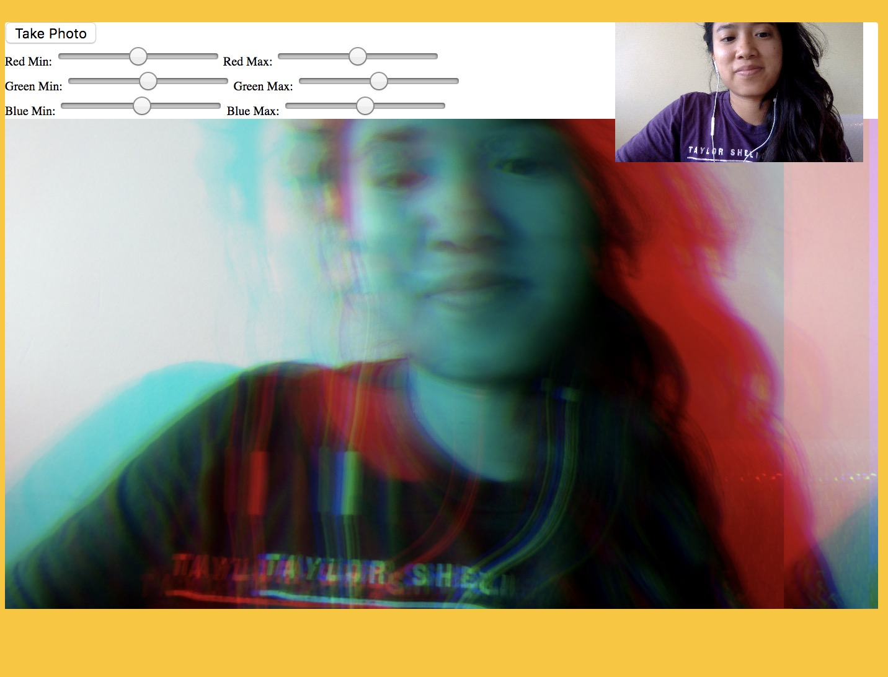

# videochatserv
> This is like another webcam fun made of pure javascript. You don't need to be angry to turn a shade a red! Mess with the settings to see yourself turn into the colors of the rainbow and save the memory with a photo. Clone this repository and run npm start.

